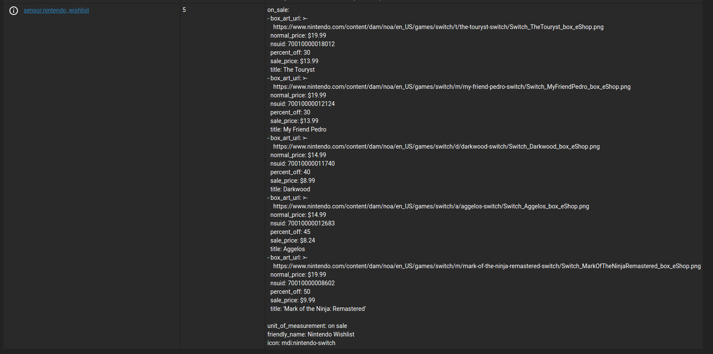
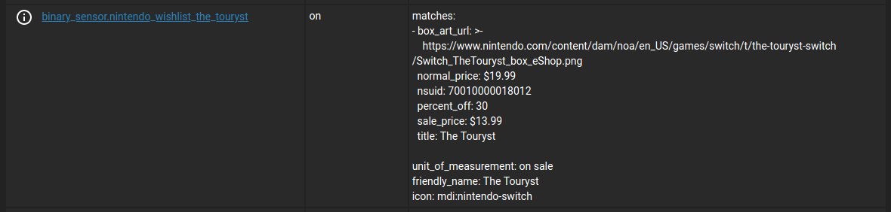
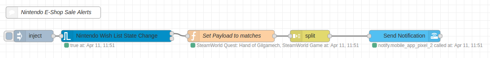

# Nintendo Wishlist Component

[](https://github.com/boralyl/steam-wishlist/releases)
[](https://github.com/custom-components/hacs)
[](LICENSE)

### NOTE: This component currently only works in certain countries.  See [Supported Countries](#supported-countries) below.

Home Assistant component that keeps track of Nintendo Switch games that are on
sale on your wish list in home assistant. (There is currently not an easy way to
get your wish list from Nintendo, so you have to keep track of it in this
component.)

## HACS Installation

1. Search for `Nintendo Wishlist Component` in the HACS Store tab.
2. Add the code to your `configuration.yaml` using the config options below.
3. **You will need to restart after installation for the component to start working.**
4. Display it in your lovelace UI using the [nintendo-wishlist-card](https://github.com/custom-cards/nintendo-wishlist-card).
5. Create an [automation to notify you](#example-node-red-flow) when a game on your wishlist goes on sale.

## Configuration

|Name|Required|Description|
|-|-|-|
|country|yes|The 2 letter country code.  See [Supported Countries](#supported-countries) below.|
|wishlist|yes|A list of Nintendo Switch titles. Each item can be the exact title or just the beginning of a title in order to match multiple games.  For example `Shantae` would trigger when any one of the many `Shantae` games goes on sale.  Read [how wishlist matching works](#how-wish-list-matching-works) below.

## Sample Configuration

*Note:* If the title contains characters that might confuse yaml like a `:` or `'` quote the entire string
like the last game in the example below.  If you do not do this your yaml may
become invalid.

```yaml
nintendo_wishlist:
  country: US
  wishlist:
    - Katana ZERO
    - OKAMI HD
    - Salt and Sanctuary
    - Dead Cells
    - Bloodstained
    - Dark Souls
    - Velocity X
    - "The Legend of Zelda: Breath of the Wild"
```

### Supported Countries

|Country Code|Country Name|
|-|-|
|AT|Austria|
|BE|Belgium|
|CA|Canada|
|CH|Schweiz/Suisse/Svizzera|
|DE|Germany|
|ES|Spain|
|FR|France|
|GB|UK/Ireland|
|IT|Italy|
|NL|Netherlands|
|PT|Portugal|
|RU|Russia|
|US|United States|
|ZA|South Africa|


### How wish list matching works

Currently wish list matching uses a very simple string comparison.  It's
possible to get false positives as it checks to see if any game on your wish
list starts with any title that is on sale.  In order to avoid false positives
try to have the title match that on the nintendo e-store as closely as possible.

Conversely, if you would like to match multiple titles that have a similar name
you can specify less of the title.  An example of this would be to add an item
to your wishlist like `Shantae`.  This would match any of the Shantae titles on
the e-shop (e.g. `Shantae and the Pirate's Curse` and `Shantae: Half-Genie Hero`.

### Sensors

After you successfully setup the integration a number of sesnors will be created.

#### `sensor.nintendo_wishlist`

This sensor will report the number of games on sale from your wishlist.
This sensor can be used with the [Nintendo Wishlist Custom Card](https://github.com/custom-cards/nintendo-wishlist-card).

[](./assets/sensor.nintendo_wishlist.png)

#### Attributes

The following state attributes are available for this sensor:

|attribute|description|
|-|-|
|on_sale|An array of [games on sale](#game-on-sale-object).|

#### Game on Sale Object

This object represents a single Nintendo Switch game on sale.

|attribute|description|
|-|-|
|box_art_url|The URL for the box art of the game.|
|normal_price|The normal price of the game.|
|nsuid|The Nintendo Switch unique ID of the game.|
|percent_off|The percentage off of the normal price.|
|sale_price|The sale price of the game.|
|title|The title of the game.|

#### `sensor.nintendo_wishlist_<title>`

A binary sensor will be created for each game on your wishlist.  It's state will
indicate if it is on sale or not.

[](./assets/sensor.nintendo_wishlist_the_touryst.png)

#### Attributes

The following state attributes are available for this sensor:

|attribute|description|
|-|-|
|matches|An array of [games on sale](#game-on-sale-object) that matched your wishlist search term.|


#### Example Node-RED Flow

You can import an [example of a node-red flow](./assets/flow.json) that sends a
notification when an item on your wish list produces an on sale match.  The flow
will send a notification for each match. You can use the inject node to test the
flow and customize it to your preferences.

[](./assets/node-red-flow.png)
